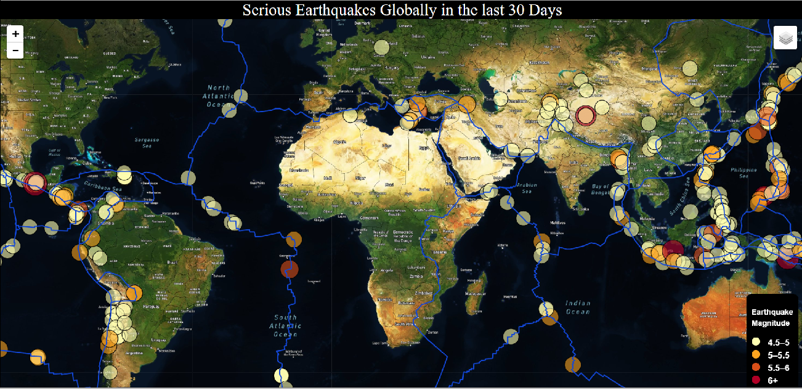

# Mapping Recent Earthquakes: JS-Leaflet

### See the interactive map [here](https://patelpurvip.github.io/EarthquakeMapping-Leaflet/).

This exercise makes use of data collected and published by the United States Geological Survey (USGS), the US federal agency responsible for providing scientific data about natural hazards, the health of ecosystems and the environment, and the impacts of climate and land-use change. USGA scientists develop new methods and tools to supply timely, relevant, and useful information about the Earth and its processes.

The purpose of this project was to visualize data on the most recent earthquakes worldwide, calling data from the USGS's website that is collected and updated daily. These types of visualizations allow us to better educate the public and other organizations in real-time, making quick use of data collected by large public agencies.

## Dataset Information
The USGS provides earthquake data in a number of different formats, updated every 5 minutes, and made available via the [USGS GeoJSON Feed](http://earthquake.usgs.gov/earthquakes/feed/v1.0/geojson.php).  Each dataset link available provides a JSON representation of that data, where the URL for JSON data can be used to pull in the data to JavaScript for visualization. 

## Visualization
For this exercise, the data were visualized using the JavaScript Leaflet library. There are several datasets available at the USGS site, but for the purposes of this exercise, I chose earthquakes of magnitude 4.5 or greater that have occurred in the last 30 days. The data feeding into the map will adjust automatically as they are updated by the USGS.  Leaflet plots all of the earthquakes from the chosen dataset based on their longitude and latitude.

Base layers for the map were called through the Mapbox.com API.

## Map Features
   * Data markers for each earthquake reflect the magnitude of the earthquake in both size and color. Earthquakes with higher magnitudes appear larger and darker in color.
   * When the markers are clicked, popups provide additional information about the earthquake (location, date, time, and magnitude).
   * A legend in the bottom righthand corner provides context for map data.

## Map Layers
A control panel in the upper righthand corner allows users to change the base layers and overlay layers for the map.

1. Base layer options:
    * Street map
    * Satellite map
    * Dark Map (to allow the markers to pop more clearly)

2. Overlay layer options
    * Earthquake markers
    * Global tectonic plate boundaries (fault lines)
-----

## Local Installation
1. Download the file to a local folder
2. Insert your personal Mapbox API key into the guest_config.js file
3. Run a local server from that folder (i.e. open a command terminal from that folder, type in 'python -m http.server' into your terminal, and hit enter).
4. Open your local host terminal in any web browser (http://localhost:8000/)
5. Do not forget to close your browser tab and stop the local server (type Ctrl C in your command terminal) when you are done.

## Copyright
1. Earthquake data and respective JSONs are available through the [USGS](http://earthquake.usgs.gov/earthquakes/feed/v1.0/geojson.php)
2. Data on tectonic plates can be found at the GitHub repository of [Hugo Ahlenius](https://github.com/fraxen/tectonicplates)
3. Map base layers are drawn from [Mapbox}(https://www.mapbox.com/)

